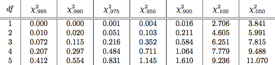
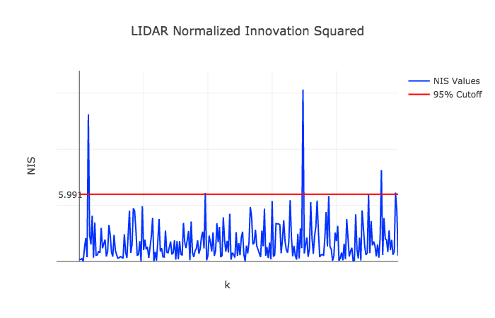

# Unscented Kalman Filter in C++
### Overview:
In a [previous repo](https://github.com/sathomas2/CarND-Extended-Kalman-Filter-Project), using a simulator provided by Udacity's Self-Driving Car team, I tracked the movement of a bicycle in real-time as it moved about a track with an Extended Kalman Filter by fusing noisy LIDAR and RADAR data. Although it worked pretty well, in this repo I'm going to use an Unscented Kalman Filter to achieve better results. The contents of this repository include:
* "data" directory containing my output files, which are discussed below, and the sensor input measurements and ground truth labels.
* "readme_images" directory containing images used in this README.
* "src" directory containing:
  * C++ Eigen Matrix library.
  * json.hpp.
  * main.cpp, which contains starter code provided by Udacity that uses WebSocketIO to communicate with the simulator and calls the Unscented Kalman Filter functions that I wrote. I've also added some lines to write an output file so I could plot the measurements, groundtruth labels, and Kalman Filter predictions that you see in this README below (line 125).
  * tools.cpp, which contains the function I wrote to calculate the Root-Mean-Squared Error of the Kalman Filter predictions.
  * ukf.cpp, which contains the Unscented Kalman Filter class and the functions I wrote, ProcessMeasurement to the process the sensor data, Prediction to generate sigma points and predict the bike's location, velocity, yaw, and yawrate as well as the covariance matrix P, and the Update functions to update the covariance matrix and the filter's belief about the bike's state depending on the type of data being processed, LIDAR or RADAR.
* CMakeLists.txt to compile the code with cmake.
* data_visualization.ipynb, a jupyter notebook walking through how I read and plotted the data I captured, which is contained in the "data" directory.
* install-mac.sh and install-ubuntu.sh to install dependencies, depending on the operating system you are using.
* project_assignment.md, the original project assignment provided by Udacity.

### Choosing Appropriate Noise Parameters:
In an Unscented Kalman Filter, in addition to the measurement noise standard deviations (lines 33-45), which are typically provided by the RADAR and LIDAR manufacturers, we need to provide proper process noise standard deviations for the acceleration and the yaw acceleration (lines 27-30) to get the filter to make accurate estimations. 

Since the simulator provides ground truth labels for velocity and yaw rate as well as a timestamp for each measurement, I can calculate the bicycle's acceleration and yaw acceleration between each timestamp. As a starting point, I set my initial standard deviations for acceleration and yaw acceleration as 1/2 of the max recorded acceleration, or 0.05 and 0.07, respectively. See the data_visualization notebook, lines 3-5, for how I did this. 

I ran the simulator once with these process noise estimates, calculating the Noise Innovation Squared for each sensor after each measurement update and writing it to a file (ukf.cpp lines 255-261 and 330-336). NIS is a metric often used to guage performance in Kalman Filters. Essentially, it calculates the difference between the expected measurement and the actual sensor measurement. It is defined as:
<figure>
  
</figure>
 

Looking at a chi-squared distribution table, I know that the NIS for 95% of LIDAR measurements, which only has two degrees of freedom Px and Py, should be less than 5.991. 95% of RADAR measurements, which have three degrees of freedom, rho, theta, and rho dot, should be less than 7.815.
 <figure>
  
</figure>
 

 
 Therefore, I can plot my NIS measurements for each sensor and see if, in fact, 95% of them fall below the expected values.
 <figure>
  
</figure>
 

  <figure>
  
</figure>
 

Because so many NIS measurements were higher than what I want, I know I need to increase my parameters. And so I did, until achieving better results, as shown below.
 <figure>
  
</figure>
 

 <figure>
  
</figure>
 

My final process noise parameters were 0.7 meters-per-seconds-squared for acceleration and 0.75 radians-per-seconds-squared for yaw acceleration. 

### Results:
<figure>
  
</figure>
 

As you can see from the above plot, my RMSE was lower for every term, Px, Py, Vx, and Vy than with my Extended Kalman Filter, whose RMSE was X: 0.0973, Y: 0.0855, VX: 0.4513, VY: 0.4399. 

Just for kicks, I decided to run the Unscented Kalman Filter only capturing LIDAR data, and again only capturing RADAR data. See below.
 <figure>
  
</figure>
 

 <figure>
  
</figure>
 

 
As expected, LIDAR alone is better at detecting position coordinates, RADAR is better at velocity, but nothing beats a little teamwork and fusing data from both sensors. See the RMSEs.
