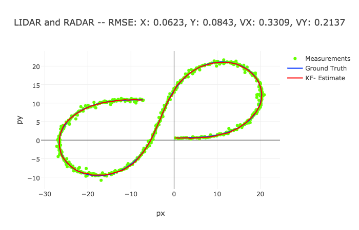

# Unscented Kalman Filter in C++
<figure>
  
</figure>
 

 
 <figure>
  
</figure>
 

 
 <figure>
  
</figure>
 

 
<figure>
  
</figure>
 

 
 <figure>
  
</figure>
 

 
 <figure>
  
</figure>
 

 
  <figure>
  
</figure>
 

 
 <figure>
  
</figure>
 

 
 <figure>
  
</figure>
 

 
   
